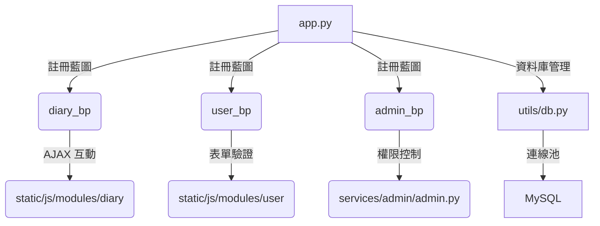

# Flask 日記專案架構解析

## 專案概覽
- **核心技術**：Flask + MySQL + Socket.IO
- **主要功能**：使用者系統、日記記錄、AI情緒分析、管理後台
- **架構特色**：模組化設計、連線池管理、前後端分離互動

## 目錄結構

 0510_flask/
├── app.py # Flask 主程序 (含 Socket.IO 初始化)
├── utils/
│ └── db.py # 資料庫連線池管理
├── services/
│ ├── diary.py # 日記功能藍圖 (表單/列表/AI分析)
│ ├── user/ # 使用者相關功能
│ └── admin/ # 管理後台功能
├── static/
│ ├── js/
│ │ ├── base.js # 全局 UI 互動 (側邊欄/滾動)
│ │ └── module/ # 各模組專用 JS
│ └── css/ # 樣式表
├── templates/ # Jinja2 模板
└── .env # 環境變數設定

## 核心元件關聯


## 資料庫設計重點
**Table: DiaryRecords**
| 欄位名稱 | 類型 | 說明 |
|---------|------|-----|
| Diary_id | INT | 主鍵 |
| User_Email | VARCHAR | 外鍵關聯使用者 |
| Diary_Content | TEXT | 日記原始內容 |
| AI_analysis_content | TEXT | AI 分析結果 |
| Created_at | DATETIME | 建立時間 |

## 主要 API 端點
```python
# 日記功能 (services/diary.py)
@diary_bp.route('/form')    # 日記表單頁
@diary_bp.route('/save', methods=['POST'])  # 日記儲存
@diary_bp.route('/list')    # 日記列表

# 管理後台 (services/admin/admin.py)
@admin_bp.route('/dashboard')  # 控制台
```

## 前端互動機制
1. **表單動態效果** (user.js)
   - 輸入框聚焦時邊框變色
   - 按鈕點擊縮放動畫
   - 訊息淡入效果

2. **日記提交流程** (diary_form.js)
   ```javascript
   fetch('/diary/save', {
     method: 'POST',
     headers: {'Content-Type': 'application/json'},
     body: JSON.stringify({
       date: "...",
       content: "...",
       state: "情緒狀態"
     })
   })
   ```

## 部署要點
```python
# .env 關鍵設定
MAIL_SERVER=smtp.zoho.com       # 郵件伺服器
DIFY_API_KEY_For_Diary=app-xxx  # AI 服務金鑰
DB_PASSWORD=NTUB                # 資料庫密碼
```

## 注意事項
1. 資料庫連線使用連接池管理 (utils/db.py)
2. 管理員權限透過電子郵件白名單控制
3. 前端互動使用事件委派(event delegation)優化效能
4. 所有敏感設定皆透過環境變數管理
