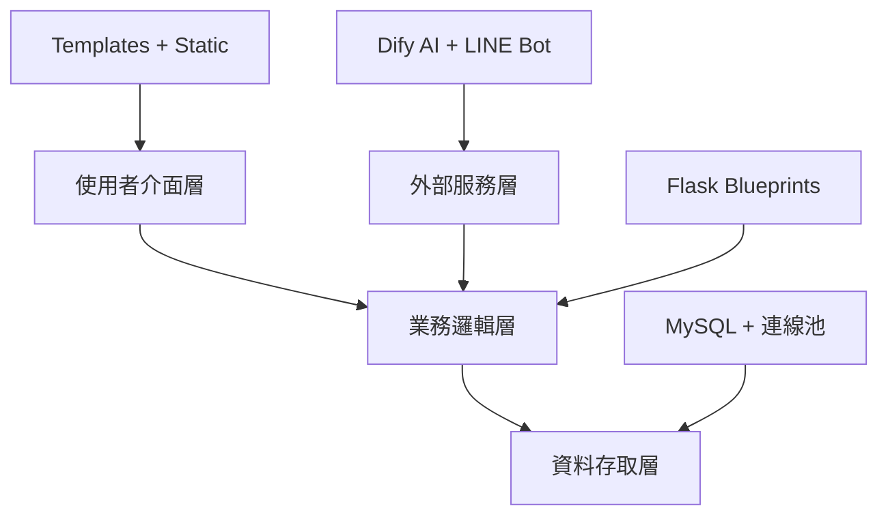
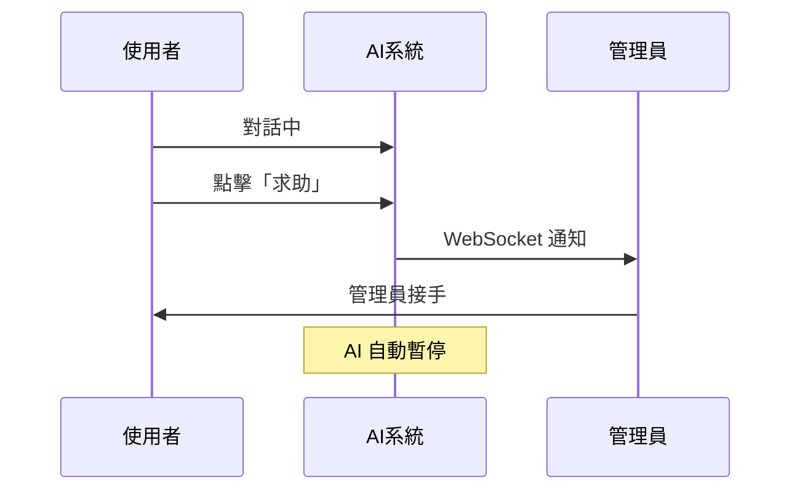

# 心理健康日記平台 - 專案精華文件 🌱

## 🎯 專案核心概覽

### 專案定位
**心理健康日記平台** - 一個融合 AI 技術的現代化心理健康支援平台

### 核心價值
- 🤖 **AI 智能分析**: 自動情緒分析與個人化建議
- 💬 **真人客服**: AI + 真人客服無縫切換
- 👥 **社交支持**: 安全的情緒分享與互動空間
- 📊 **數據洞察**: 完整的情緒追蹤與管理後台

## 🏗️ 技術架構精要

### 技術棧
```yaml
後端框架: Python Flask 3.1.0
資料庫: MySQL + 連線池管理 (DBUtils + PyMySQL)
即時通訊: Flask-SocketIO + eventlet
AI 服務: Dify API 整合
郵件服務: SMTP (Zoho)
外部整合: LINE Bot SDK
前端技術: HTML5 + CSS3 + Vanilla JavaScript
模板引擎: Jinja2
```

### 架構設計理念


## 📁 模組化架構詳解

### 核心模組清單
```
services/
├── user/           👤 使用者系統 (註冊/登入/設定)
├── diary/          📖 智能日記 (CRUD + AI 分析)
├── ai/             🤖 AI 聊天機器人
├── admin/          🛡️ 管理後台 (用戶/內容/客服)
├── social/         👥 社交互動 (貼文/留言/按讚)
├── line/           📱 LINE Bot 整合
├── support/        ❓ 幫助文檔
├── announcement/   📢 公告系統
└── socketio_manager.py 📡 即時通訊管理
```

### Blueprint 註冊架構
```python
# app.py - 模組化註冊
app.register_blueprint(user_bp,      url_prefix="/user")
app.register_blueprint(diary_bp,     url_prefix="/diary")
app.register_blueprint(ai_chat_bp,   url_prefix="/ai")
app.register_blueprint(admin_bp,     url_prefix="/admin")
app.register_blueprint(social_bp,    url_prefix="/social")
```

## 🔧 核心功能深度解析

### 1. 智能日記系統 (`services/diary/`)
**技術亮點**: Dify API 情緒分析 + 前端即時反饋
```python
# 核心流程
用戶輸入 → AI 分析 → 資料庫儲存 → 即時 UI 更新
```

**前端交互**:
```javascript
// diary_form.js - 情緒選擇 + AI 回饋
const response = await fetch('/diary/save', {
    method: 'POST',
    body: JSON.stringify({
        content: diaryContent,
        emotion: selectedEmotion
    })
});
```

### 2. AI 聊天系統 (`services/ai/`)
**技術亮點**: 對話連續性 + 真人客服無縫切換
```python
# 關鍵機制
session_id → conversation_id → Dify API → WebSocket 廣播
```

**轉真人流程**:


### 3. 即時通訊架構 (`socketio_manager.py`)
**技術亮點**: 命名空間分離 + 會話狀態管理
```python
# 核心事件
@socketio.on("connect", namespace="/chat")          # 連線管理
@socketio.on("subscribe_to_session", namespace="/chat")  # 訂閱會話
@socketio.on("msg_added", namespace="/chat")        # 訊息廣播
```

### 4. 管理後台系統 (`services/admin/`)
**技術亮點**: 權限白名單 + 即時客服面板
```python
# 權限控制
ADMIN_EMAILS = set(os.getenv("ADMIN_EMAILS", "").split(","))

def is_admin():
    return current_user.is_authenticated and current_user.id in ADMIN_EMAILS
```

### 5. 社交互動系統 (`services/social/`)
**技術亮點**: 匿名發文 + 評論聚合
```python
# 資料聚合查詢
SELECT p.*, COUNT(l.Like_id) AS likes_count
FROM Posts p
LEFT JOIN Likes l ON p.Post_id = l.Post_id
GROUP BY p.Post_id
```

## 💾 資料庫設計精要

### 連線池配置
```python
# utils/db.py - 高效能連線管理
pool = PooledDB(
    creator=pymysql,
    mincached=5,      # 最小連線數
    maxcached=10,     # 最大空閒連線
    maxconnections=20, # 總連線上限
    blocking=True,    # 連線等待
    autocommit=True   # 自動提交
)
```

### 核心資料表
```sql
-- 使用者系統
User (User_Email, User_name, password_hash, bio, ...)

-- 日記系統
DiaryRecords (Diary_id, User_Email, Diary_Content, AI_analysis_content, ...)

-- 社交系統
Posts (Post_id, User_Email, Content, Is_public, ...)
Comments (Comment_id, Post_id, User_Email, Content, ...)
Likes (Like_id, Post_id, User_Email, ...)

-- AI 聊天系統
AIChatSessions (session_id, user_email, need_human, is_open, ...)
AIChatLogs (id, session_id, role, message, ...)
```

## 🔐 安全性設計

### 1. 認證與授權
```python
# 密碼加密
bcrypt.hashpw(password.encode('utf-8'), salt)

# 權限控制
@login_required
@admin_required
```

### 2. 環境變數管理
```env
# .env 配置
SECRET_KEY=flask_secret_key
DB_PASSWORD=database_password
DIFY_API_KEY_For_Diary=ai_service_key
ADMIN_EMAILS=admin@example.com
```

### 3. SQL 注入防護
```python
# 參數化查詢
cursor.execute("SELECT * FROM User WHERE User_Email = %s", (email,))
```

## 🎨 前端架構設計

### 模組化 JavaScript
```
static/js/
├── base.js                    # 全域功能 (側邊欄/主題)
└── modules/
    ├── diary/
    │   ├── diary_form.js      # 日記表單互動
    │   └── diary_list.js      # 列表篩選排序
    ├── ai/
    │   └── ai_chat.js         # WebSocket 聊天
    ├── admin/
    │   └── admin.js           # 後台客服面板
    └── social/
        └── social_main.js     # 社交互動
```

### 前後端通訊模式
```javascript
// AJAX + WebSocket 混合架構
// 1. 資料操作使用 AJAX
fetch('/api/endpoint', {method: 'POST', ...})

// 2. 即時通訊使用 WebSocket
socket.emit('subscribe_to_session', {session_id, role})
socket.on('msg_added', handleNewMessage)
```

## 🚀 部署與維運

### 開發環境啟動
```bash
# 1. 安裝依賴
pip install -r requirements.txt

# 2. 設定環境變數
cp .env.example .env

# 3. 啟動應用
python app.py  # 開發模式 (含 SocketIO)
```

### 生產環境部署
```python
# app.py - WSGI 包裝
if __name__ == '__main__':
    socketio.run(app, debug=True)
else:
    application = WSGIApp(socketio, app)  # 生產環境
```

### 性能優化要點
1. **連線池管理**: 自動連線復用與回收
2. **靜態資源**: CSS/JS 模組化載入
3. **WebSocket**: 事件驅動減少輪詢
4. **資料庫**: 索引優化與查詢聚合

## 📊 系統監控與日誌

### 日誌系統
```python
# 統一日誌配置
logging.basicConfig(
    filename="logs/app.log",
    level=logging.INFO,
    format="%(asctime)s %(levelname)s: %(message)s"
)
```

### 管理員儀表板
- 📊 系統統計 (用戶數、日記數)
- 👥 用戶列表與活動記錄
- 📝 日記內容審核
- 💬 即時客服面板

## 🎓 學習價值與技術亮點

### 1. 現代 Web 開發最佳實踐
- **模組化設計**: Flask Blueprint 架構
- **前後端分離**: AJAX + RESTful API
- **即時通訊**: WebSocket 事件驅動
- **安全性**: 認證授權 + 參數化查詢

### 2. AI 技術整合
- **外部 API 整合**: Dify 服務串接
- **對話狀態管理**: session + conversation 機制
- **智能切換**: AI ↔ 真人客服無縫轉換

### 3. 系統設計思維
- **高併發處理**: 連線池 + 非同步 I/O
- **用戶體驗**: 漸進式載入 + 即時反饋
- **可維護性**: 分層架構 + 模組解耦

## 🔮 未來擴展方向

### 技術升級
- [ ] Redis 快取層
- [ ] Docker 容器化
- [ ] 微服務拆分
- [ ] 前端框架化 (Vue.js/React)

### 功能增強
- [ ] 情緒趨勢分析
- [ ] 群組治療功能
- [ ] 行動裝置 APP
- [ ] 多語言支援

---

## 📝 總結

這個專案展現了現代 Web 應用開發的完整技術棧，從底層的資料庫連線池管理，到上層的 AI 服務整合，每一個技術選型都有其深思熟慮的理由。

**核心競爭力**:
1. **技術深度**: 連線池、WebSocket、AI 整合
2. **架構設計**: 模組化、分層、可擴展
3. **用戶體驗**: 即時互動、智能分析、安全保障
4. **商業價值**: 心理健康市場的技術解決方案

這不僅是一個技術專案，更是一個展示現代 Web 開發能力和系統思維的優秀作品。
